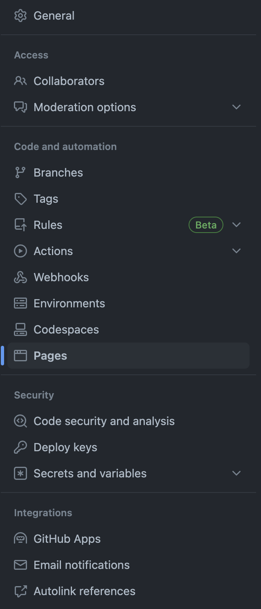
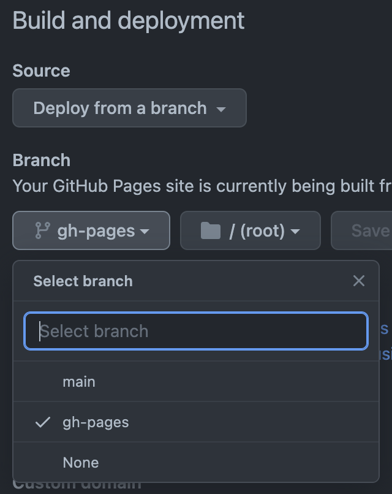
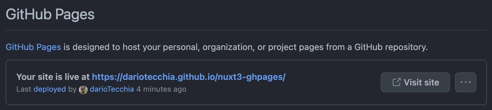

# Nuxt3 x GitHub Pages

Welcome on this repo!

This is a basic template of an application using Nuxt3 published within the Github pages.

This is possible through the use of the gh-pages library.

## Getting Started

### What is **Nuxt3**?
Nuxt3 is a easy-to-use Web Framework based on Vue3 with Server Side Rendering.

You can found more infos and docs on Nuxt3 on https://nuxt.com/.

### What is **gh-pages**?
gh-pages is a library which allows you to publish files to a gh-pages branch on GitHub (or any other branch anywhere else).

You can found more infos and docs on gh-pages on https://github.com/tschaub/gh-pages.

## Basic Usage
### Configuration
We need to configure correctly the baseUrl path inside the **nuxt.config.ts** file.

If this is the main GitHub Pages repo, in example **dariotecchia.github.io**, we need an empty base url:
```ts
// https://nuxt.com/docs/api/configuration/nuxt-config
export default defineNuxtConfig({
  app: {
    baseURL: ''
  },
})
```
Or you can delete this property.

If you want to deploy a repo hosted on a different repo you need to configure the baseURL with the name of the repo:
```ts
// https://nuxt.com/docs/api/configuration/nuxt-config
export default defineNuxtConfig({
  app: {
    baseURL: '/nuxt3-ghpages/'
  },
})
```
As you can see, in this case the value is `/nuxt3-ghpages/`, the name of this repo.
### First Deploy
The use is really simple.

First, an initial "deployment" must be done via gh-pages to allow the branch to be created from where the GitHub Pages will be deployed.

To do this we need to install the node modules via the `npm install` command, make sure everything is ok by doing a first local deployment via `npm run dev`.

If everything was ok then we can proceed with the first deploy and the automatic creation of the deployment branch.

Run the command `npm run deploy`, which will just run the command `nuxt generate && gh-pages --dotfiles -d .output/public`, so first the deployment package is generated via `nuxt generate` and then the contents of _`.output/public`_ is pushed to the gh-pages branch.

After this is successfully executed we can move to the repository settings to go and set up the GitHub Pages.

### Setting up GitHub Pages
Go in the Settings tab:


Go in the Pages menu:


Choose the branch where gh-pages push the dist directory:


Now wait for deploy. If everything will be ok you can found this:


You can find the deploy at this url: https://dariotecchia.github.io/nuxt3-ghpages/